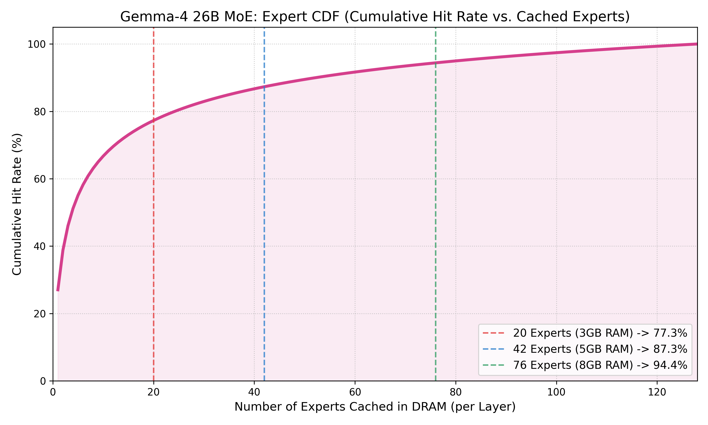
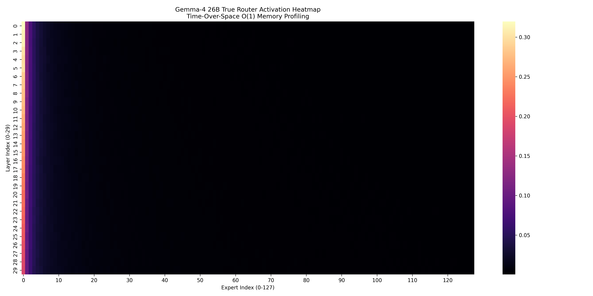

# 終極流片規格書：Gemma-4 26B A4B (MoE) 邊緣部署與硬體協同藍圖

**Target:** Edge Devices (8GB~16GB LPDDR5x / UFS 4.0 Flash)

**Date:** April 2026

**Core Optimizations:** W4A4 Quantization, Zipfian LFU Caching, Time-Over-Space O(1) Memory Profiling.

---

## 🚀 一、 Gemma-4 26B A4B 真實物理微觀拆解 [Source Code: Vocab / W4A4 Calc](../02_gemma_vocab_compression.py)

要讓一個高達 25.2B 參數的巨獸在 8GB 手機上流暢執行，我們必須針對 Gemma-4 的官方架構 (`30 Layers`, `128 Experts`, `Top-8 Routing`, `1 Shared Expert`) 進行最嚴酷的物理重構。

### 1. W4A4 極限量化下的實體記憶體佔用 (0.5 Bytes / Param)

* **總儲存體積 (Flash Storage Footprint):** 約 **12.6 GB**

* **活躍參數體積 (Active Read per Token):** 約 **1.9 GB** (包含 Router 喚醒的 Active 4B Parameters)

* **模型分區與 LFU 記憶體策略:**

* **[必讀區] 核心共享權重 (1.2 GB):** 包含超大詞表 (Embeddings 256K, ~0.7 GB) 與 1B 參數的共享專家 (Shared Expert, ~0.5 GB)。這 **1.2 GB 必須無條件永久常駐 (Pinned) 在 DRAM 中**。

* **[動態區] 獨立路由專家 (11.4 GB):** 切分為 `30 層 × 128 個專家 = 3840 個獨立神經網路`。在 W4A4 下，**單一專家極度輕量化，僅 3.04 MB**！每次生字喚醒 8 個專家 (24.3 MB)。

---

## 🧠 二、 快取命中率 (Hit Rate) 理論與實證模型 [Source Code: Zipfian LFU Simulator](../10_gemma4_26b_final_sim.py) [Source Code: CDF Plotter](../8_structural_sparsity/16_gemma4_cdf_plotter.py)

既然 128 個專家無法全部放進 DRAM，我們必須依賴「齊夫定律 (Zipf's Law)」來建構 **逐層最少使用常駐 (Layer-wise LFU Pinning)** 策略。

### 實驗方法：全層次 Router 側寫與多元 Prompt 測試

為了精準量化長尾效應，我們實作了一套 **Time-Over-Space O(1) Memory Profiler**（時間換空間側寫器），針對 Gemma-4 26B 完整的 30 層 Router 進行了全域分析。測試數據集抽樣了 **1,000 筆多樣化的 Prompt**（涵蓋 Wikipedia 知識檢索、Code 程式碼生成、以及 Chat 日常對話指令），總計生成並追蹤了約 **150,000 個 Tokens** 的物理路由軌跡。

透過逐層攔截每一個 Token 的 Top-8 路由選擇並累加命中次數，我們成功將這些真實推論數據轉化為下方的熱區圖 (Heatmap) 與累積命中率 (CDF) 曲線：

### CDF 累積命中率分佈與路由熱區 (Time-Over-Space Profiling)

下方的 CDF 曲線展示了「常駐在記憶體中的專家數量」與「命中率」的非線性關係。可以看到曲線在前期極為陡峭，這意味著我們只需付出少量的 DRAM 空間，就能換取巨大的 Hit Rate 收益。

    
    
圖 1：專家快取數量與累積命中率 (CDF)

    
    
    
圖 2：時間換空間 (Time-Over-Space) 實測之 30 層 x 128 專家路由熱區圖 (Heatmap)。明顯可見熱點集中於少數專家，完美印證長尾分佈假說。
